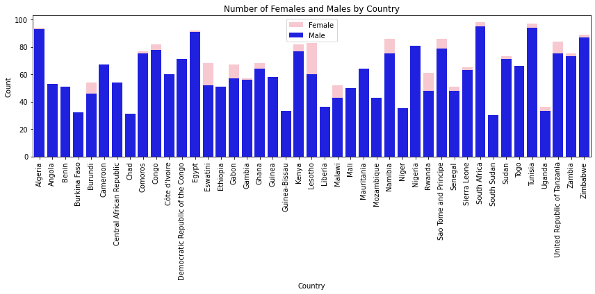
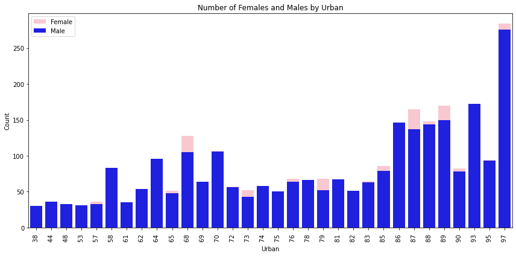
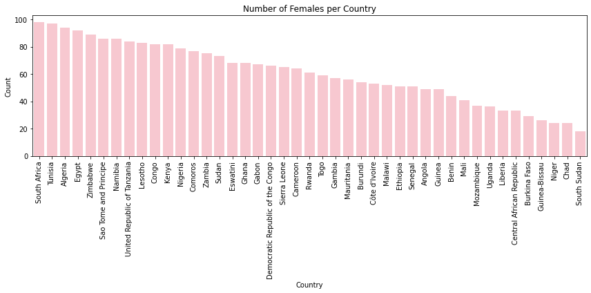
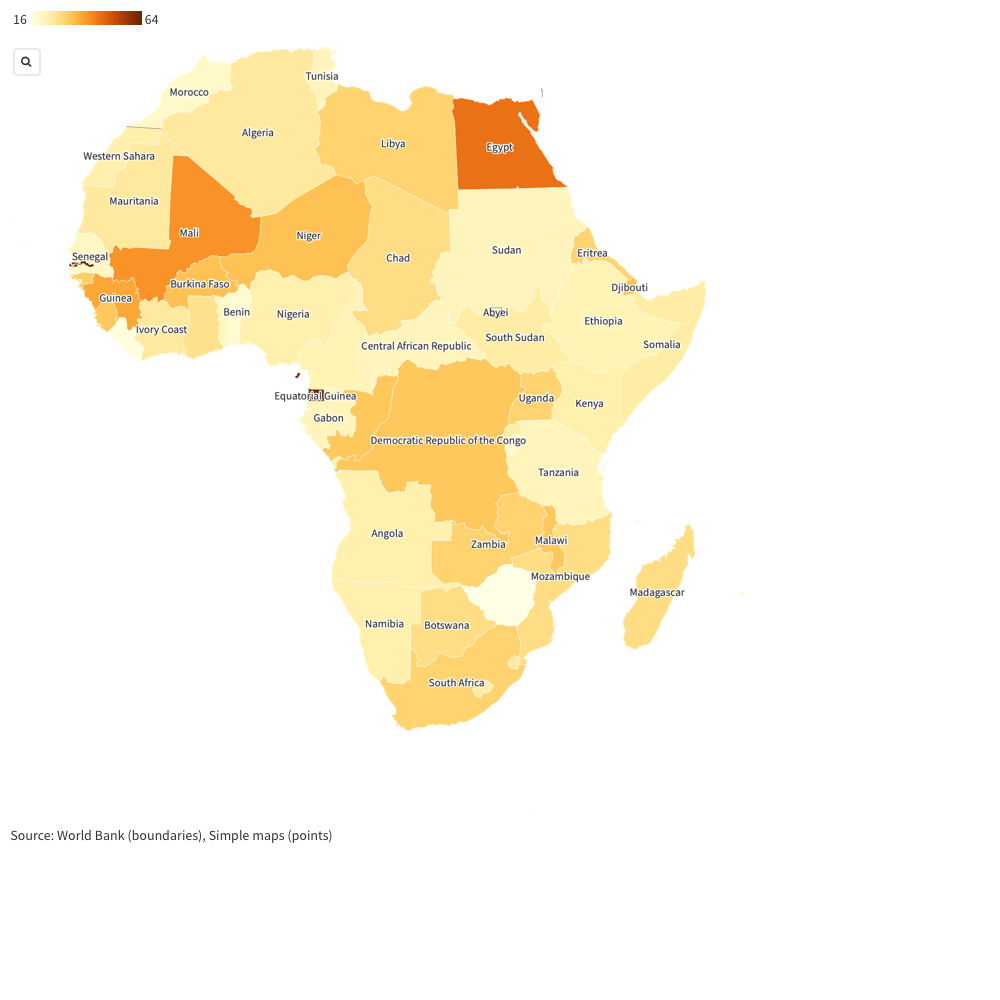

# Visualizing Female School Dropout Rates: Unveiling Educational Disparities 

The project aims to understand the reasons behind the high dropout rate of girls from school. 
By analyzing the comprehensive dataset provided by [UNICEF](https://data.unicef.org/topic/gender/gender-disparities-in-education/) and using various visualization techniques, 
we will explore the number of school dropouts at different educational levels. 
Our goal is to identify the root causes and challenges that hinder girls' educational progress. With these insights, 
we will provide actionable recommendations to empower women and prevent further dropout rates. 
By leveraging data-driven visualizations, we strive to create a transformative impact and break the cycle of educational disadvantage for girls.

In order to ** narrow down our analysis to specifically focus on the dropout of African girls from school **, we created a subset of the main dataset. 
This subset only includes the columns that are relevant to the girl child dropout phenomenon.

```new_data = school_data.loc[:,['Country','Africa-sub-regions','Male', 'Female','Urban','Rural']]
# first rows to display
new_data.head()```

```# removing non-African nations

school = new_data.dropna(subset=['Country','Africa-sub-regions'])
school```

we use pd.to_numeric to convert the 'Female' and 'Male' columns to numeric types, handling any non-numeric values with the 'coerce' option.

```import matplotlib.pyplot as plt
import seaborn as sns`

# Convert 'Female' and 'Male' columns to numeric types
school['Female'] = pd.to_numeric(school['Female'], errors='coerce')
school['Male'] = pd.to_numeric(school['Male'], errors='coerce')

# Group the data by country and calculate the total number of females and males
gender_counts = school.groupby('Country')[['Female', 'Male']].sum().reset_index()

# Plotting the bar chart using seaborn
plt.figure(figsize=(12, 6))
sns.barplot(x='Country', y='Female', data=gender_counts, color='pink', label='Female')
sns.barplot(x='Country', y='Male', data=gender_counts, color='blue', label='Male')
plt.title('Number of Females and Males by Country')
plt.xlabel('Country')
plt.ylabel('Count')
plt.xticks(rotation=90)
plt.legend()
plt.tight_layout()
plt.show()```




```import seaborn as sns
import matplotlib.pyplot as plt

# Filter the dataset for rows where 'Female' column is numeric
numeric_female_data = school[pd.to_numeric(school['Female'], errors='coerce').notnull()]

# Sort the data by number of females in descending order
sorted_data = numeric_female_data.sort_values('Female', ascending=False)

# Plotting the bar chart using seaborn
plt.figure(figsize=(12, 6))
sns.barplot(x='Country', y='Female', data=sorted_data, color='pink')
plt.title('Number of Females per Country')
plt.xlabel('Country')
plt.ylabel('Count')
plt.xticks(rotation=90)
plt.tight_layout()
plt.show()```







### How To Contribute

- Fork this project.

- Clone this project.

### Open the terminal at the project root directory:-

##### Run the following commands
- git clone https://github.com/Jadamoureen/Unveiling_Educational_Disparities.git
- Commit your changes.
- Push to your repo.
- Send us a Pull Request (PR).
- Wait for PR review.
- After Approve your contribution will go up.
- If not approved you will get response.

### Why should you Contribute?
- Build a solution
- Improves coding skills.
- Connect with people of likemind.
